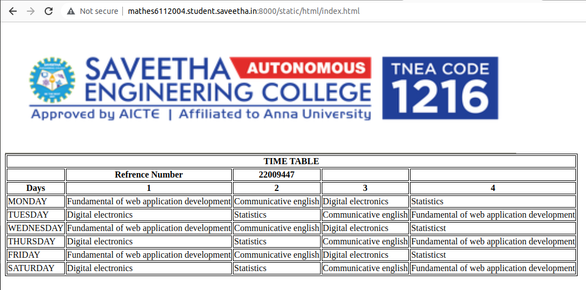

# Experiment_Time_Table

## AIM
To Write a html webpage page to display your timetable.

# ALGORITHM
### STEP 1
create a simple table using table tag
### STEP 2
Add header row using th tag
### STEP 3
Add your timetable
### STEP 4
Execute the program

# CODE
```
<!DOCTYPE html>
<html lang="en">
    <head>
        <title>My Timetable</title>
    </head>
    <body>
        <h1>My Timetable</h1>
        
        <table border="3">
            <tr>
                <td align="center" colspan="10">TIME TABLE</td>
            <tr>
                <td colspan="5">REFERENCE NUMBER:22008651</td>
                <td colspan="5">NAME:JAIGANESH S</td>
                <td colspan="5"></td>
            </tr>    
                <td>DAYS</td>
                <td>1</td>
                <td>2</td>
                <td>3</td>
                <td>4</td>
                <td>5</td>
                <td>6</td>
                <td>7</td>
                <td>8</td>
                <td>9</td>
            <tr>
                <td>MONDAY</td>
                <td>FreePeriod</td>
                <td>FreePeriod</td>
                <td>web</td>
                <td>web</td>
                <td>lunch</td>
                <td>Python</td>
                <td>Python</td>
                <td>Physics</td>
                <td>Physics</td>
                </tr>
            <tr>
            </tr>
                <td>TUESDAY</td>
                <td>FreePeriod</td>
                <td>FreePeriod</td>
                <td>web</td>
                <td>web</td>
                <td>lunch</td>
                <td>Python</td>
                <td>Python</td>
                <td>Physics</td>
                <td>Physics</td>
            <tr></tr>
                <td>WEDNESDAY</td>
                <td>FreePeriod</td>
                <td>FreePeriod</td>
                <td>web</td>
                <td>web</td>
                <td>lunch</td>
                <td>Python</td>
                <td>Python</td>
                <td>Physics</td>
                <td>Physics</td>
            </tr>
            <tr>
                <td>THURSDAY</td>
                <td>FreePeriod</td>
                <td>FreePeriod</td>
                <td>web</td>
                <td>web</td>
                <td>lunch</td>
                <td>Python</td>
                <td>Python</td>
                <td>Physics</td>
                <td>Physics</td>
            </tr>
            <tr>
                <td>FRIDAY</td>
                <td>FreePeriod</td>
                <td>FreePeriod</td>
                <td>web</td>
                <td>web</td>
                <td>lunch</td>
                <td>Python</td>
                <td>Python</td>
                <td>Physics</td>
                <td>Physics</td>
            </tr>    
            <tr>
                <td>SATURDAY</td>
                <td>FreePeriod</td>
                <td>FreePeriod</td>
                <td>web</td>
                <td>web</td>
                <td>lunch</td>
                <td>Python</td>
                <td>Python</td>
                <td>Physics</td>
                <td>Physics</td>
            </tr>
                
            </tr>    
            </tr>
        </table>
    </body>
</html>
```
### Timetable 


# OUPUT

The resulted output is received.
